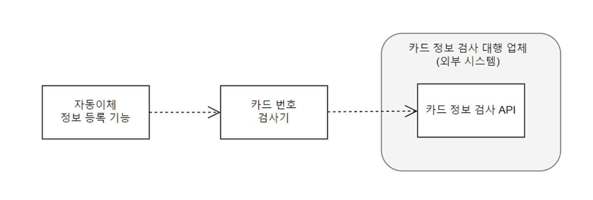
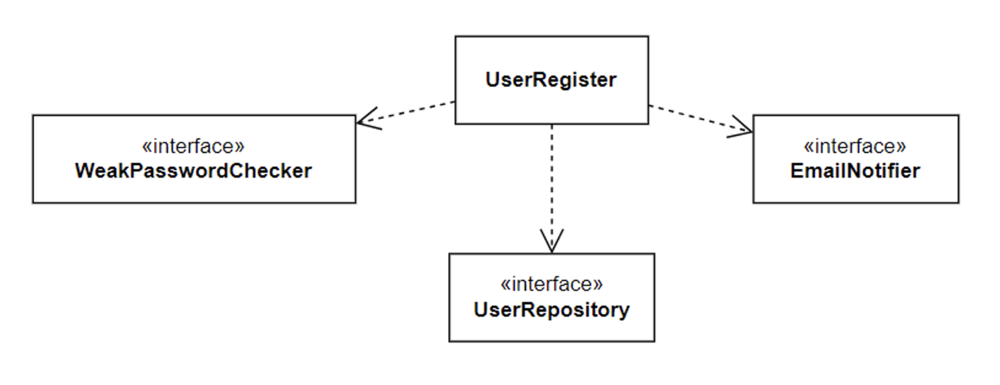

# 대역

## 대역의 필요성

> - 테스트 대상에서 파일 시스템을 사용
> - 테스트 대상에서 DB로부터 데이터를 조회하거나 데이터를 추가
> - 테스트 대상에서 외부의 HTTP 서버와 통신

외부 요인에 의존하면 테스트를 작성하고 실행하기 어렵다. 따라서 외부 요인은 테스트 작성을 어렵게 만들고 테스트 결과도 예측할 수 없게 만든다.

그래서 테스트 대상에서 의존하는 외부 요인 때문에 테스트가 어려운 경우에는 대역을 사용해서 테스트를 진행할 수 있다.

외부 API를 사용하는 자동이체 기능을 예시로 보자.



구조는 다음과 같다. 

`AutoDebitRegister -> CardNumberValidator <---API 통신---> 외부 카드 정보 API`

```java
// AutoDebitRegister class
public class AutoDebitRegister {

    private CardNumberValidator validator;
    private AutoDebitInfoRepository repository;

    public AutoDebitRegister(CardNumberValidator validator, AutoDebitInfoRepository, repository) {
        this.validator = validator;
        this. repository = repository;
    }

    public RegisterResult register(AutoDebitReq req) {
        CardValidity validity = validator.validate(req.getCardNumber());
        if (validity != CardValidity.VALID) {
            return RegisterResult.error(validity);
        }
        AutoDebitInfo info = repository.findOne(req.getUserId());
        if (info != null) {
            info.changeCardNumber(req.getCardNumber());
        } else {
            AutoDebitInfo newInfo = new AutoDebitInfo(req.getUserId(), req.getCardNumber(), LocalDateTime.now());
            repository.save(newInfo);
        }
        return RegisterResult.success();
    }
}
```

```java
// CardNumberValidator class
public class CardNumberValidator {

    public CardValidity validate(String cardNumber) {
        HttpClient httpClient = HttpClient.newHttpClient();
        HttpRequest request = HttpClient.builder()
            .uri(URI.create("https://......."))
            .header("Content-Type", "text/plain")
            .POST(BodyPublishers.ofString(cardNumber))
            .build();
        try {
            HttpResponse<String> response = httpClient.send(request, BodyHandlers.ofString());

            switch(response.body) {
                case "ok" return CardValidity.VALID;
                case "bad" return CardValidity.INVALID;
                case "expired" return CardValidity.EXPIRED;
                case "theft" return CardValidity.THEFT;
                default: return CardValidity.UNKNOWN;
            }
        } catch(IOException | InterruptedException e) {
            return CardValidity.ERROR;
        }
    }
}
```

```java
// 실제 구현을 사용하는 테스트 코드
public class AutoDebitRegisterTest {

    private AutoDebitRegister register;

    @BeforeEach
    void setUp() {
        CardNumberValidator validator = new CardNumberValidator();
        AutoDebitInfoRepository repository = new JpaAutoDebitInfoRepository();
        register = new AutoDebitRegister(validator, repository); // 주입
    }

    @Test
    void validCard() {
        // 업체에서 받은 테스트용 유효한 카드번호 사용
        AutoDebitReq req = new AutoDebitReq("user1", "1234123412341234");
        RegisterResult result = this.register.regisger(req);
        assertEquals(VALID, result.getValidity());
    }

    @Test
    void theftCard() {
        // 업체에서 받은 도난 테스트용 카드번호 사용
        AutoDebitReq req = new AutoDebitReq("user1", "12345678901213");
        RegisterResult result = this.register.regisger(req);
        assertEquals(THEFT, result.getValidity());
    }
}
```

만약 1달 뒤 카드번호가 바뀌는 경우, 테스트는 실패하게 된다. 따라서 외부 요인을 제어할 수 없으니까 대역을 사용해보자.

## 대역을 이용한 테스트

대역을 이용해 AutoDebitRegisterTest를 다시 작성해보자. 먼저 CardNumberValidator를 대신할 대역 클래스를 만든다.

Stub 클래스는 단순한 구현으로 실제 구현을 대신한다.

```java
// StubCardNumberValidator
public class StubCardNumberValidator extends CardNumberValidator {

    private String invalidNo;

    public void setInvalidNo(String invalidNo) {
        this.invalidNo = invalidNo;
    }

    @Override
    public CardValidity validate(String cardNumber) {
        if (invalidNo != null && invalidNo.equals(cardNumber)) {
            return CardValidity.INVALID;
        }
        return CardValidity.VALID;
    }
}
```

이제 대역을 사용한 테스트 코드를 작성해보자.

```java
public class AutoDebitRegister_Stub_Test {

    private AutoDebitRegister register;
    private StubCardNumberValidator stubValidator;
    private StubAutoDebitInfoRepository stubRepository;

    @BeforeEach
    void setUp() {
        stubValidator = new StubCardNumberValidator();
        stubRepository = new StubAutoDebitInfoRepository();
        register = new AutoDebitRegister(stubValidator, stubRepository); // stub 객체 주입
    }

    @Test
    void invalidCard() {
        stubValidator.setInvalidNo("123123123");

        AutoDebitReq req = new AutoDebitReq("user1", "123123123");
        RegisterResult result = register.register(req);

        assertEquals(INVALID, result.getValidity());
    }
}
```

이번에는 도난 카드에 대한 테스트를 진행한다고 하자. 이 경우도 단순하게 대역 클래스에 도난 카드번호를 지정하고 비교하는 코드만 추가하면 된다.

```java
// 도난 카드번호를 위한 코드를 추가한 대역 클래스
public class StubCardNumberValidator extends CardNumberValidator {

    private String invalidNo;
    private String theftNo;

    public void setInvalidNo(String invalidNo) {
        this.invalidNo = invalidNo;
    }

    public void setTheftNo(String theftNo) {
        this.theftNo = theftNo;
    }

    @Override
    public CardValidity validate(String cardNumber) {
        if (invalidNo != null && invalidNo.equals(cardNumber)) {
            return CardValidity.INVALID;
        }

        if (theftNo != null && theftNo.equals(cardNumber)) {
            return CardValidity.THEFT;
        }

        return CardValidity.VALID;
    }
}
```

그러면 테스트코드는 아래와 같다.

```java
public class AutoDebitRegister_Stub_Test {

    private AutoDebitRegister register;
    private StubCardNumberValidator stubValidator;
    private StubAutoDebitInfoRepository stubRepository;

    @BeforeEach
    void setUp() {
        stubValidator = new StubCardNumberValidator();
        stubRepository = new StubAutoDebitInfoRepository();
        register = new AutoDebitRegister(stubValidator, stubRepository); // stub 객체 주입
    }

    @Test
    void invalidCard() {
        stubValidator.setInvalidNo("123123123");

        AutoDebitReq req = new AutoDebitReq("user1", "123123123");
        RegisterResult result = register.register(req);

        assertEquals(CardValidity.INVALID, result.getValidity());
    }

    @Test
    void theftCard() {
        stubValidator.setTheftNo("1234567890");

        AutoDebitReq req = new AutoDebitReq("user1", "1234567890");
        RegisterResult result = register.register(req);

        assertEquals(CardValidity.THEFT, result.getValidity());
    }
}
```

또한 DB 연동 코드 또한 대역을 사용하기에 좋다. 해당 부분을 인터페이스로 처리를 해보자.

```java
// DB 연동을 위한 레포지토리 인터페이스
public interface AutoDebitInfoRepository {
    
    void save(AutoDebitInfo info);
    AutoDebitInfo findOne(String userId);
}
```

그러면 AutoDebitRegister는 아래 주석 부분을 대역으로 처리를 해보자.

```java
// AutoDebitRegister class
public class AutoDebitRegister {

    private CardNumberValidator validator;
    private AutoDebitInfoRepository repository;

    public AutoDebitRegister(CardNumberValidator validator, AutoDebitInfoRepository, repository) {
        this.validator = validator;
        this. repository = repository;
    }

    public RegisterResult register(AutoDebitReq req) {
        CardValidity validity = validator.validate(req.getCardNumber());
        if (validity != CardValidity.VALID) {
            return RegisterResult.error(validity);
        }
        AutoDebitInfo info = repository.findOne(req.getUserId()); // 대역 처리 가능
        if (info != null) {
            info.changeCardNumber(req.getCardNumber());
        } else {
            AutoDebitInfo newInfo = new AutoDebitInfo(req.getUserId(), req.getCardNumber(), LocalDateTime.now());
            repository.save(newInfo); // 대역 처리 가능
        }
        return RegisterResult.success();
    }
}
```

```java
// MemoryAutoDebitInfoRepository (AutoDebitRegister의 대역 구현)
public class MemoryAutoDebitInfoRepository implements AutoDebitInfoRepository {

    private Map<String, AutoDebitInfo> infos = new HashMap<>();

    @Override
    public void save(AutoDebitInfo info) {
        infos.put(info.getUserId(), info);
    }

    @Override
    public AutoDebitInfo findOne(String userId) {
        return infos.get(userId);
    }
}
```

이제 대역을 사용한 테스트 코드를 작성해보자.

```java
public class AutoDebitRegister_Fake_Test {

    private AutoDebitRegister register;
    private StubCardNumberValidator cardNumberValidator;
    private MemoryAutoDebitInfoRepository repository;

    @BeforeEach
    void setUp() {
        cardNumberValidator = new StubCardNumberValidator();
        repository = new MemoryAutoDebitInfoRepository();
        regisger = new AutoDebitInfo(cardNumberValidator, repository);
    }

    @Test
    void alreadyRegistered_InfoUpdated() {
        repository.save(new AutoDebitInfo("user1", "111222333444", LocalDateTime.now()));
        
        AutoDebitReq req = new AutoDebitReq("user1", "1234567890");
        RegisterResult result = this.register.register(req);

        AutoDebitInfo saved = repository,findOne("user1");
        assertEquals("1234567890", saved.getCardNumber());
    }

    @Test
    void notYetRegistered_newInfoRegistered() {
        AutoDebitReq req = new AutoDebitReq("user1", "1234123412341234");
        RegisterResult result = this.register.register(req);

        AutoDebitInfo saved = repository.findOne("user1");
        assertEquals("1234123412341234", saved.getCardNumber());
    }
}
```

## 대역을 사용한 외부 상황 흉내와 결과 검증

위의 코드에서 얻은 부분은 `외부카드정보API 연동`과 `자동이체 정보를 저장한DB`없이 AutoDebitRegister에 대한 테스트를 수행했다.

여기서 알 수 있는 점은 DB를 연동하지 않고도 매우 빠르게 테스트를 할 수 있는 점이다.

또한 MemoryAutoDebitInfoRepository를 사용하면서 외부 상황 결과를 눈으로 검증까지 할 수 있다.

- 외부 상황 흉내 성공
- 외부 상황 결과 검증

## 대역의 종류

> - stub: 구현을 단순화한 것으로 대체, StubCardNumberValidator가 해당
> - fake: 제품으로 사용하지는 않지만, 실제 동작하는 구현을 제공, MemoryAutoDebitInfoRepository가 해당
> - spy: 호출된 내역을 기록, 기록내용은 테스트 결과를 검증할 때 사용(= stub)
> - mock: 기대한 대로 상호작용하는지 행위 검증 (= stub, spy)



- UserRegister: 회읜가입 핵심 로직 수행
- WeakPasswordChecker: 암호가 약한지 검사
- UserRepository: 회원 정보 저장 및 조회
- EmailNotifier: 이메일 발송

### 약한 암호 확인 기능에 stub 사용

먼저 테스트 대상은 UserRegister이기 때문에 WeakPasswordChecker는 대역으로 사용하자. 이렇게 하면 각 타입의 역할을 분리할 수 있다.

```java
public class UserRegisterTest {

    private UserRegister userRegister;
    private StubWeakPassowordChecker stubPasswordChecker = new StubWeakPassowordChecker();

    @BeforeEach
    void setUp() {
        userRegister = new UserRegister(stubPasswordChecker);
    }

    @DisplayName("약한 암호면 가입 실패")
    @Test
    void weakPassword() {
        stubPasswordChecker.setWeak(true); // 주목할 부분!

        assertThrows(WeakPasswordException.class, () -> {
            userRegister.register("id", "pw", "email");
        });
    }
}
```

지금은 해당 클래스 또는 인터페이스가 없기 떄문에 커파일 에러가 발생한다. WeakPasswordException의 클래스를 작성하자.

```java
// WeakPasswordException class
public class WeakPasswordException extends RuntimeException {
}
```

이제 WeakPassowordChecker를 구현하자. 이 타입은 stub이기 때문에 인터페이스 구현하고 StubWeakPassowordChecker에서 구현을 해야한다.

```java
// WeakPasswordChecker interface
public interface WeakPasswordChecker {
}
```

```java
// WeakPasswordChecker를 구현한 StubWeakPasswordChecker 클래스 생성
public class StubWeakPasswordChecker implements WeakPasswordChecker {
    
    private boolean weak;

    public void setWeak(boolean weak) {
        this.weak = weak;
    }
}
```

마지막으로 UserRegister 클래스를 만들어 컴파일 에러를 제거한다.

```java
// UserRegister.class
public class UserRegister {

    private WeakPasswordChecker passwordChecker;

    public UserRegister(WeakPasswordChecker passwordChecker) {
        this.passwordChecker = passwordChecker;
    }

    public void register(String id, String pw, String email) {
        // 구현 전
    }
}
```

테스트 코드를 실행하면 assertThrows 부분에서 테스트가 실패한다. 직접적으로 예외를 return할 수 있지만, 좀 더 일반화를 하자.

```java
// UserRegister.class
public class UserRegister {

    private WeakPasswordChecker passwordChecker;

    public UserRegister(WeakPasswordChecker passwordChecker) {
        this.passwordChecker = passwordChecker;
    }

    public void register(String id, String pw, String email) {
        if (passwordChecker.checkPasswordWeak(pw)) {
            throw new WeakPasswordException();
        }
    }
}
```

WeakPasswordChecker 인터페이스에서 checkPasswordWeak를 구현한다.

```java
// WeakPasswordChecker interface
public interface WeakPasswordChecker {

    boolean checkPasswordWeak(String pw);
}
```

```java
// WeakPasswordChecker를 구현한 StubWeakPasswordChecker 클래스 생성
public class StubWeakPasswordChecker implements WeakPasswordChecker {
    
    private boolean weak;

    public void setWeak(boolean weak) {
        this.weak = weak;
    }

    @Override
    public boolean checkPasswordWeak(String pw) {
        return weak;
    }
}
```

### 레포지토리를 가짜 구현으로 사용

다음에는 동일 ID를 가진 회원이 존재할 경우 예외를 발생하는 테스트를 작성하자. 먼저 테스트 골격을 만들자.

```java
// given
동일 ID를 가진 회원 존재
상황을 만들기 위한 코드

// when, then
assertThrows(DupIdException.class(), () -> {
    userRegister.register("id", "pw", "email");
});
```

이제 가장 먼저 테스트 코드를 만들어보자.

```java
// UserRegisterTest
public class UserRegisterTest {

    private UserRegister userRegister;
    private StubWeakPassowordChecker stubPasswordChecker = new StubWeakPassowordChecker();
    private MemoryUserRepository fakeRepository = new MemoryUserRepository(); // 가짜 대역

    @BeforeEach
    void setUp() {
        userRegister = new UserRegister(stubPasswordChecker, fakeRepository);
    }

    ...

    @DisplayName("이미 같은 ID가 존재하면 가입 실패")
    @Test
    void dupIdExists() {
        // 이미 같은 ID 존재하는 상황 만들기
        fakeRepository.save(new User("id", "pw1", "email@email.com"));

        assertThrows(DupIdException.class(), () -> {
            userRegister.register("id", "pw2", "email");
        });
    }
}
```

컴파일 에러가 발생할 것이다. 이제 컴파일 에러를 제거하자.

```java
// UserRepository interface
public interface UserRepository {
}
```

```java
// MemoryUserRepository class
public class MemoryUserRepository implements UserRepository {
}
```

```java
// UserRegister class
public class UserRegister {

    private WeakPasswordChecker passwordChecker;
    private UserRepository userRepository;

    public UserRegister(WeakPasswordChecker passwordChecker, UserRepository userRepository) {
        this.passwordChecker = passwordChecker;
        this.userRepository = userRepository;
    }

    public void register(String id, String pw, String email) {
        if (passwordChecker.checkPasswordWeak(pw)) {
            throw new WeakPasswordException();
        }
    }
}
```

이제는 User에서 발생하는 컴파일 에러를 제거햐자.

```java
// User
public class User {

    private String id;
    private String password;
    private String email;

    public User(String id, String password, String email) {
        this.id = id;
        this. password = password;
        this.email = email;
    }

    public String getId() {
        return id;
    }

    public String getEmail() {
        return email;
    }
}
```

fakeRepository의 save 부분의 컴파일 에러를 해결하자.

```java
public interface UserRepository {

    void save(User user);
}
```

```java
// MemoryUserRepository
public class MemoryUserRepository implements UserRepository {

    private Map<String, User> users = new HashMap<>();

    @Override
    public void save(User user) {
        users.put(user.getUserId(), user);
    }
}
```

마지막은 예외 부분의 컴파일 에러를 제거하자.

```java
// DupIdException
public class DupIdException extends RuntimeException {
}
```

이제 실행을 하면 예외 때문에 테스트가 실패한다. UserRegister 클래스에 해당 예외를 일반화하자.

```java
// UserRegister
public class UserRegister {

    private WeakPasswordChecker passwordChecker;
    private UserRepository userRepository;

    public UserRegister(WeakPasswordChecker passwordChecker, UserRepository userRepository) {
        this.passwordChecker = passwordChecker;
        this.userRepository = userRepository;
    }

    public void register(String id, String pw, String email) {
        if (passwordChecker.checkPasswordWeak(pw)) {
            throw new WeakPasswordException();
        }
        User user = userRepository.findById(id);
        if (user != null) {
            throw new DupIdException();
        }
    }
}
```

아직 findById가 없기 때문에 컴파일 에러가 발생할 것이다.

```java
public interface UserRepository {

    void save(User user);
    User findById(String id);
}
```

```java
public class MemoryUserRepository implements UserRepository {

    private Map<String, User> users = new HashMap<>();

    @Override
    public void save(User user) {
        users.put(user.getUserId(), user);
    }

    @Override
    public User findById(String id) {
        return user.get(id);
    }
}
```

이제 테스트를 작성하자. 회원 가입에 성공하는 테스트는 레포지토리에 새로운 사용자 정보가 저장되면 된다.

```java
// 회원가입에 성공하는 테스트
public class UserRegisterTest {
    
    ...

    @DisplayName("같은 ID가 없으면 가입 성공함")
    @Test
    void noDupId_RegisterSuccess() {
        userRegister.register("id", "pw", "email");

        User savedUser = fakeRepository.findById("id"); // 가입 결과 확인, 대역
        assertEquals("id", savedUser.getId());
        assertEquals("email", savedUser.getEmail());
    }
}
```

테스트를 통과시키기 위해 save를 추가한다.

```java
// UserRegister
public class UserRegister {

    private WeakPasswordChecker passwordChecker;
    private UserRepository userRepository;

    public UserRegister(WeakPasswordChecker passwordChecker, UserRepository userRepository) {
        this.passwordChecker = passwordChecker;
        this.userRepository = userRepository;
    }

    public void register(String id, String pw, String email) {
        if (passwordChecker.checkPasswordWeak(pw)) {
            throw new WeakPasswordException();
        }
        User user = userRepository.findById(id);
        if (user != null) {
            throw new DupIdException();
        }

        userRepository.save(new User(id, pw, email)); // 최종 저장
    }
}
```

### 이메일 발송 여부를 확인하기 위해 스파이 사용

회원가입을 성공하면 이메일을 발송한다고 하자. 테스트 골격은 아래와 같다.

```java
// given
userRegister.register("id", "pw", "email@email.com");

// when, then
email@somedomain.com으로 이메일 발송을 요청했는지 확인
```

그러면 어떻게 확인을 할 수 있을까? EmailNotifier의 Spy 대역을 사용하면 된다. 

먼저 EmailNotifier의 스파이 대역이 이메일 발송 여부 발송을 요청할 때 이메일 주소를 제공할 수 있어야 한다.

```java
// EmailNotifier
public class SpyEmailNotifier implements EmailNotifier {

    private boolean called;
    private String email;

    public boolean isCalled() {
        return called;
    }

    public String getEmail() {
        return email;
    }
}
```

```java
public interface EmailNotifier {
}
```

이제 Spy 대역을 사용해서 이메일 발송 여부를 확인하자.

```java
// UserRegisterTest
public class UserRegisterTest {
    
    private UserRegister userRegister;
    private StubWeakPassowordChecker stubPasswordChecker = new StubWeakPassowordChecker();
    private MemoryUserRepository fakeRepository = new MemoryUserRepository();
    private SpyEmailNotifier spyEmailNotifier = new SpyEmailNotifier(); // 대역

    @BeforeEach
    void setUp() {
        userRegister = new UserRegister(stubPasswordChecker, fakeRepository, spyEmailNotifier);
    }

    @DisplayName("가입하면 메일을 전송함")
    @Test
    void whenRegisterThenSendEmail() {
        userRegister.register("id", "pw", "email@email.com");

        assertTrue(spyEmailNotifier.isCalled());
        assertEquals("email@email.com", spyEmailNotifier.getEmail());
    }
}
```

컴파일 에러를 제거하자.

```java
// UserRegister
public class UserRegister {

    private WeakPasswordChecker passwordChecker;
    private UserRepository userRepository;
    private EmailNotifiere emailNotifier;

    public UserRegister(WeakPasswordChecker passwordChecker, UserRepository userRepository, EmailNotifiere emailNotifier) {
        this.passwordChecker = passwordChecker;
        this.userRepository = userRepository;
        this.emailNotifier = emailNotifier;
    }

    public void register(String id, String pw, String email) {
        if (passwordChecker.checkPasswordWeak(pw)) {
            throw new WeakPasswordException();
        }
        User user = userRepository.findById(id);
        if (user != null) {
            throw new DupIdException();
        }

        userRepository.save(new User(id, pw, email)); // 최종 저장
    }
}
```

이제 테스트 코드를 실행하면 assertTrue에서 실패가 나온다. 왜냐하면 디폴트로 세팅한 값이 나오기 때문이다. 따라서 해당 부분을 통과하려면 2가지를 작업해야 한다.

- UserRegister가 EmailNotifier의 이메일 발송 기능을 호출
- Spy의 에밍ㄹ 발송 기능 구현에서 호출 여부 기록

```java
// UserRegister
public class UserRegister {

    private WeakPasswordChecker passwordChecker;
    private UserRepository userRepository;
    private EmailNotifiere emailNotifier;

    ...

    public void register(String id, String pw, String email) {
        if (passwordChecker.checkPasswordWeak(pw)) {
            throw new WeakPasswordException();
        }
        User user = userRepository.findById(id);
        if (user != null) {
            throw new DupIdException();
        }

        userRepository.save(new User(id, pw, email));

        emailNotifier.sendRegisterEmail(email);
    }
}
```

```java
public interface EmailNotifier {

    void sendRegisterEmail(String email);
}
```

```java
// EmailNotifier
public class SpyEmailNotifier implements EmailNotifier {

    private boolean called;
    private String email;

    public boolean isCalled() {
        return called;
    }

    public String getEmail() {
        return email;
    }

    @Override
    void sendRegisterEmail(String email) {
        this.called = true;
        this.email = email;
    }
}
```

테스트를 돌리면 성공한다.

### 모의 객체로 스텁과 스파이 대체

앞서 작성한 테스트를 모의 객체로 바꿔서 다시 작성을 해보자. 모의 객체를 사용하기 위해서는 `Mockito`를 사용해야 한다.

먼저 약한 암호인 경우 가입에 실패하는 테스트를 모의 객체로 바꿔보자.

```java
// UserRegisterMockTest
public class USerRegisterMockTest {

    private UserRegister userRegister;
    private WeakPasswordChecker mockPasswordChecker = Mockito.mock(WeakPasswordChecker.class); // 모의 객체 생성
    private MemoryUserRepository fakeRepository = new MemoryUserRepository();
    private EmailNotifier mockEmailNotifier = Mockito.mock(EmailNotifier.class); // 모의 객체 생성

    @BeforeEach
    void setUp() {
        userRegister = new UserRegister(mockPasswordChecker, fakeRepository, mockEmailNotifier);
    }

    @DisplayName("약한 암호면 가입 실패")
    @Test
    void weakPassword() {
        BDDMockito.given(mockPasswordChecker.checkPasswordWeak("pw")).willReturn(true);

        assertThrows(WeakPasswordException.class, () -> {
            userRegister.register("id", "pw", "email");
        });
    }

    @DisplayName("회원 가입시 암호 검사 수행항")
    @Test
    void checkPassword() {
        userRegister.register("id", "pw", "email");

        // 인자로 전달한 mockPasswordChecker 모의 객체가 임의의 Stirng값을 이용해서 특정 메소드(checkPasswordWeak())가 호출되었는지 검증
        BDDMockito.then(mockPasswordChecker).should().checkPasswordWeak(BDDMockito.anyString());
    }

    @DisplayName("가입하면 메일을 전송함")
    @Test
    void whenRegusterThenSendEmail() {
        userRegister.register("id", "pw", "email");

        // 모의 객체 sendRegisterEmail() 메소드에 사용된 인자 값을 구하는 것
        ArgumentCaptor<String> captor = ArgumentCaptor.forClass(string.class);
        BDDMockito.then(mockEmailNotifier).should().sendRegisterEmail(captor.capture());

        String realEmail = captor.getValue();
        assertEquals("email@email.com", realEmail);
    }
}
```

## 상황과 결과 확인을 위한 협업 대상 도출과 대역 사용

위의 코드들과 같이 외부 상황을 제어하기 힘든 상황이 있는경우는 대역을 사용해야 한다. 다음과 같은 순서를 따라가면 좋다.

> - 제어하기 힘든 외부 상황을 `별도 타입으로 분리`
> - `테스트 코드는 별도로 분리한 타입의 대역을 생성`
> - `생성한 대역`을 테스트 대상의 생성자 등을 이용해서 `전달`
> - `대역을 이용해서 상황 구성`

## 대역과 개발 속도

대역을 사용하면 실제 구현없이 다양한 상황에 테스트가 가능하고 속도가 매우 빠르다.

즉, 대역은 의존하는 대상을 구현하지 않아도 테스트 대사을 완성할 수 있게 만들어주며 이는 대기 시간을 줄여 개발 속도를 올린다.

## 모의 객체를 과하게 사용금지

모의 객체(mock)은 stub과 spy를 제공한다. 하지만 mock을 과하게 많이 사용하면 테스트 코드가 복잡해진다.

```java
// mock을 많이 사용한 경우, 테스트코드가 복잡해진다.
@Test
void noDupId_RegisterSuccess() {
    userRegister.register("id", "pw", "email");

    ArgumentCaptor<User> captor = ArgumentCaptor.forClass(User.class);
    BDDMockito.then(mockUserRepository).should().save(captor.capture());

    User savedUser = captor.getValue();
    assertEquals("id", savedUser.getId());
    assertEquals("email", savedUser.getEmail());
}
```

만약 메모리를 이용한 fake 구현을 하면 훨씬 간결해진다.

```java
@Test
void 같은_ID가_없으면_가입() {
    userRegister.register("id", "pw", "email");

    User savedUser = fakeRepository.save("id");
    assertEquals("id", savedUser.getId());
    assertEquals("email", savedUser.getEmail());
}
```

결론적으론느 모의 객체를 많이 사용하면 결과 검증 코드가 길어진다. 

심지어 모의 객체는 기본적으로 메소드 호출 여부를 검증하는 수단이기 때문에 테스트 대상과 모의 객체 간의 상호작용이 바뀌면 테스트는 실패한다.

따라서 모의 객체 메소드 호출 여부를 결과 검증 수단으로 사용하는 것을 지양해야 한다. `특히 저장소에 대한 대역은 모의 객체 대신 메모리를 이용한 가짜 구현을 사용하는 것이 좋다.`