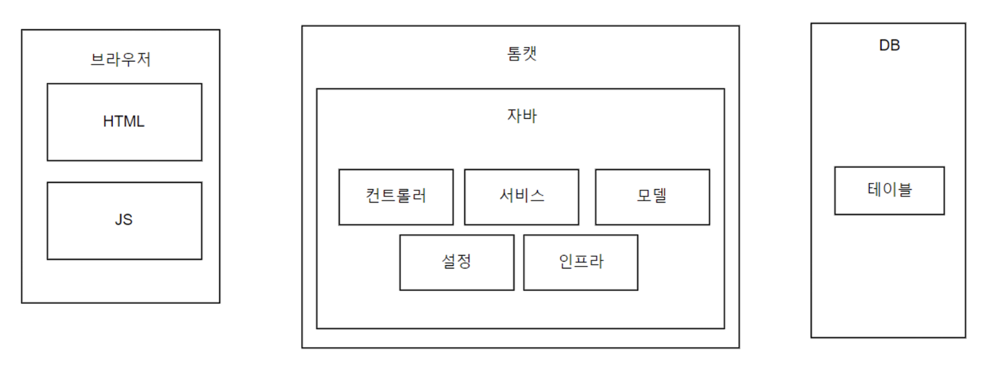
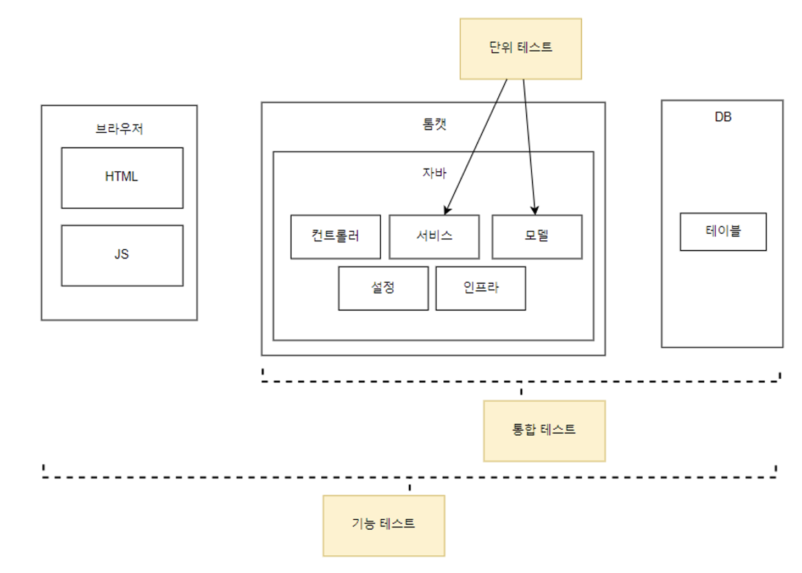
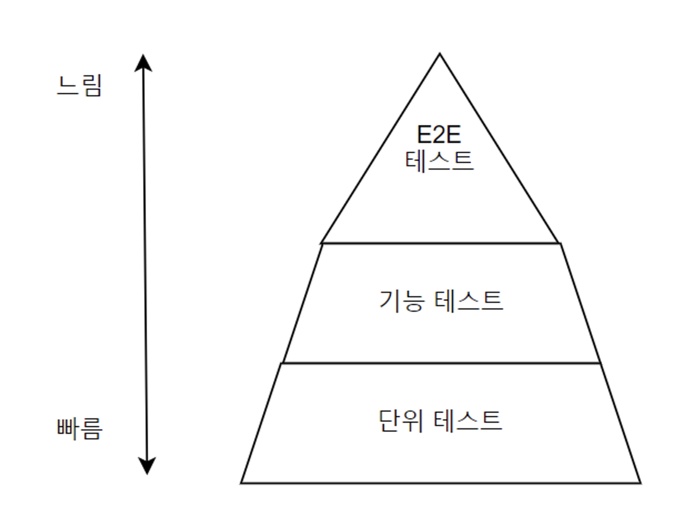

# 테스트 범위와 종류

## 테스트 범위





### 기능 테스트, E2E 테스트

기능 테스트는 사용자 입장에서 시스템이 제공하는 기능이 잘 동작하는지 확인한다. 따라서 기능 테스트를 하기 위해서는 시스템을 구동하는 모든 구성요소가 필요하다.

왜냐하면 기능 테스트는 사용자가 직접 사용하는 웹 브라우저나 모바일 앱부터 시작해서 DB나 외부 서비스에 이르기까지 모든 구성 요소를 하나로 묶어 진행한다.

따라서 끝(브라우저)에서 부터 끝(DB)까지 모든 구성 요소를 논리적으로 하나의 기능으로 보기 때문에 E2E 테스트로도 볼 수 있다.

일반적으로 QA조직에서 하는 테스트가 E2E 테스트이다.

### 통합 테스트

각 시스템의 구성 요소가 올바르게 연동되는지 확인하는 것이다. 기능 테스트는 사용자 입장에서 테스트를 하는 것이고, 통합 테스트는 소프트웨어의 코드를 직접 테스트한다.

예시로, 기능 테스트는 앱을 통해 가입 기능을 테스트하는 것이고, 통합 테스트는 회원 가입 코드를 직접 테스트 하는 것이다.

### 단위 테스트

단위 테스트는 개별 코드나 컴포넌트가 기대한대로 동작하는지 확인한다. 단위 테스트는 한 클래스나 한 메소드와 같은 작은 범위를 테스트한다.

일부 의존 대상은 stub 또는 모의 객체를 통해 대역으로 대체한다.

### 테스트 범위 간 차이



일반적으로 단위 테스트를 통합 테스트보다 많이 작성하고, 반드시 통합 테스트는 작성해야 한다. 왜냐하면 각 컴포넌트 기능들이 유기적으로 잘 동작하는지 확인해야 하기 때문이다.

또한 단위 테스트의 속도가 매우 빠르다. 왜냐하면 특별히 의존하거나 하는 부분이 상당히 적고 테스트를 위해서 필요로 하는 DB, 외부 요인이 적기 때문이다. 따라서 테스트 속도가 빠른 단위 테스트에서 다양한 상황을 다루는 것이 좋다. 그리고 통합 테스트 또는 기능테스트에서는 주요 상황에 초점을 맞춰야 한다.

그래야 테스트 실행 시간이 증가래 피드백이 느려지는 것을 방지할 수 있다.

## 외부 연동이 필요한 테스트 예시

외부(DB, HTTP, Kafka)와의 연동이 많을 수록 통합 테스트는 힘들다.

### 스프링 부트와 DB 통합 테스트

통합 테스트는 실제로 DB를 사용한다. 따라서 DB에 데이터를 추가하고 존재하지 않는 상황을 만들기 위해 데이터를 삭제해야 한다.

```java
@SpringBootTest
public class UserRegisterIntTest {

    @Autowired
    private UserRegister register;
    @Autowired
    private JdbcTemplate jdbcTemplate;

    @Test
    void 동일ID가_이미_존재하면_예외() {
        // given
        jdfcTemplate.update(
            "INSERT INTO user VALUES (?, ?, ?) " +
            "ON DUPLICATE KEY UPDATE password = ?, email = ?" +
            "cbk", "pw", "cbk@cbk.com", "pw", "cbk@cbk.com"
        );

        // when, then
        assertThrows(DupIdException.class,
            () -> register.register("cbk", "strongpw", "email@email.com")
        );
    }

    @Test
    void 존재하지_않으면_저장() {
        // given
        jdbcTemplate.update("DELETE FROM user WHERE id = ?", "cbk");

        // when, then
        register.register("cbk", "strongpw", "email@email.com");
        SqlRowSet rs = jdbcTemplate.queryForRowSet(
            "SELECT * FROM user WHERE id = ?", "cbk"
        );
        rs.next();
        assertEquals("email@email.com", rs.getString("email"));
    }
}
```

이번에는 비교를 위해 단위 테스트를 만들자. 동일 ID가 존재하는 상황을 만들자.

```java
public class UserRegisterTest {

    private UserRegister userRegister;
    private MemoryUserRepository fakeRepository = new MemoryUserRepository();

    @Test
    void 이미_같은ID_존재하면_가입_실패() {
        fakeRepository.save(new User("id", "pw1", "email@email.com"));
        assertThrows(DupIdException.class, 
            () -> userRegister.register("id", "pw2", "email")
        );
    }
}
```

단위 테스트와 통합 테스트 시간을 비교하면 통합 테스트가 더 오래 걸린다. 그 이유는 통합 테스트를 하면 스프링 컨테이너를 생성하는 과정이 필요하기 때문이다.

### WireMock을 이용한 REST 클라이언트 테스트

통합 테스트하기 어려운 대상이 외부 서버이다. 따라서 테스트를 하려면 외부의 카드 정보 제공 API와 통신을 해야 하는데 원하는 상황을 쉽게 만들 수 없다.

```java
// 외부의 HTTP 서버를 이용하는 코드
public class CardNumberValidator {

    private string server;

    public CardNumberValidator(String server) {
        this.server = server;
    }

    public CardValidity validate(String cardNumber) {
        HttpClient httpClient = HttpClient.newHttpClient();
        HttpRequest request = HttpRequest.newBuilder()
            .uri(URL.create(server + "/card"))
            .header("Content-Type", "text/plain")
            .POST(BodyPublishers.ofString(cardNumber))
            .timeout(Duration.ofSeconds(3)) // 타임 아웃 3초
            .build();
        
        try {
            HttpResponse<String> response = httpClient.send(request, BodyHandlers.ofString());
            switch (resposne.body()) {
                case "ok": return CardValidity.VALID;
                case "bad": return CardValidity.INVALID;
                case "expired": return CardValidity.EXPIRED;
                case "theft": return CardValidity.THEFT;
                default: return CardValidity.UNKNOWN;
            }
        } catch (HttpTimeoutException e) { // 타임 아웃 관련 예외
            return CardValidity.TIMEOUT;
        } catch (IOException | InterruptedException e) {
            return CardValidity.ERROR;
        }
    }
}
```

하지만 WireMock을 사용하면 서버API를 스텁으로 대체할 수 있다.

```java
// WireMock을 이용한 REST 클라이언트 테스트
public class CardNumberValidatorTest {

    private WireMockServer wireMockServer;

    @BeforeEach
    void setUp() {
        wireMockServer = new WireMockServer(options().port(8089));
        wireMockServer.start();
    }

    @AfterEach
    void tearDown() {
        woreMockServer.stop();
    }

    @Test
    void valid() {
        wireMockServer.stubFor(post(urlEqualTo("/card")))
            .withRequestBody(equalTo("1234567890"))
            .willReturn(aResponse()
                .withHeader("Content-Type", "text/plain")
                .withBody("ok"));
        
        CardNumberValidator validator = new CardNum"berValidator("http://localhost:8089");
        CardValidity validity = validator.validate("1234567890");
        assertEquals(CardValidity.VALID, validity);
    }

    @Test
    void timeout() {
        wireMockServer.stubFor(post(urlEqualTo("/card")))
            .willReturn(aResponse()
                .withFixedDelay(5000)); // 응답은 5초 뒤에
        
        CardNumberValidator validator = new CardNum"berValidator("http://localhost:8089");
        CardValidity validity = validator.validate("1234567890");
        assertEquals(CardValidity.TIMEOUT, validity);
    }
}
```

WireMockServer는 HTTP서버의 흉내 낸다.

- 테스트 실행 전 WireMockServer를 시작하면 실제 HTTP 서버가 뜬다.
- 테스트에서 WireMockServer의 동적을 기술한다.
- HTTP 연동을 수행하는 테스트를 실행한다.
- 테스트 실행 후에 WireMockServer를 중지한다.

### 스프링 부트의 내장 서버를 이용한 API 기능 테스트

스프링 부트를 사용하면 내장 톰캣을 사용해서 API에 대한 테스트를 JUnit 코드로 작성할 수 있다.

```java
@SpringBootTest(
    webEnvironment = SpringBootTest.WebEnvironment.RANDOM_PORT
)
public class UserApiE2ETest {

    @Autowired
    private TestRestTemplate restTemplate;

    @Test
    void weakPwResposne() {
        String reqBody = "...."; // JSON 형태
        RequestEntity<String> request = RequestEntity.post(URI.create("/users"))
            .contentType(MediaType.APPLICATION_JSON_UTF8)
            .body(reqBody);
        RequestEntity<String> response = restTemplate.exchange(request, String.class);

        assertEquals(HttpStatus.BAD_REQUEST, response.getStatusCode());
        assertTrue(response.getBody().contains("WeakPasswordException"));
    }
}
```

스프링 부트는 테스트에서 웹 환경을 구동할 수 있는 기능을 제공한다. 해당 기능을 사용하면 내장서버(톰캣)을 구동하고 스프링 웹 APP을 실행한다.

TestRestTemplate은 스프링 부트가 테스트 목적으로 제공하는 것으로서 내장 서버에 연결하는 RestTemplate이다.